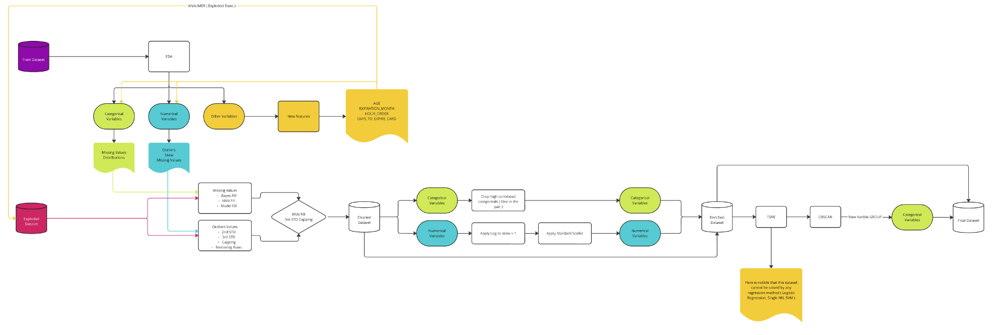
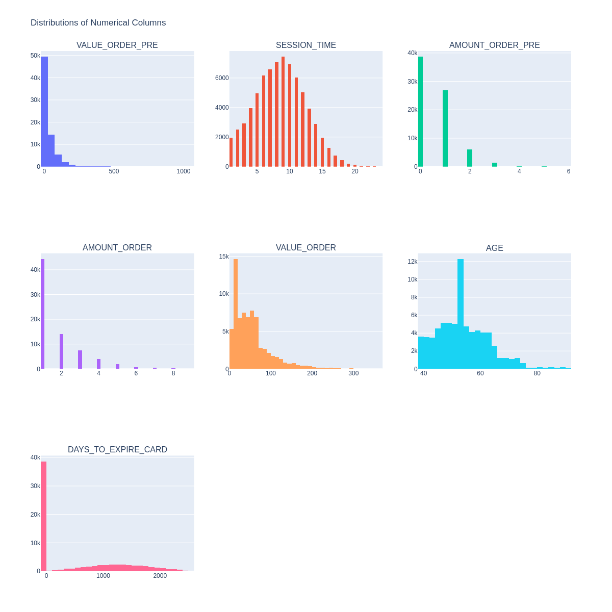
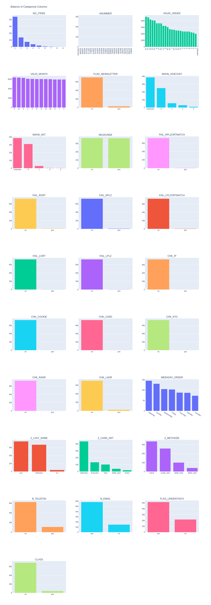
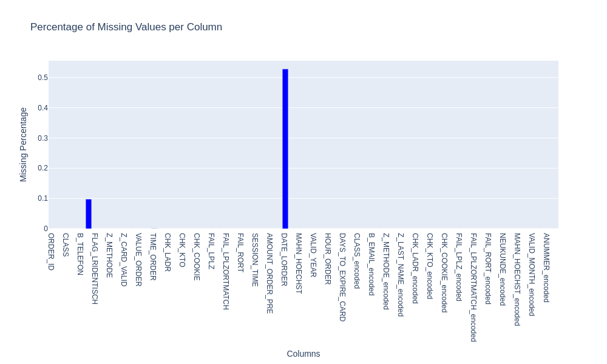
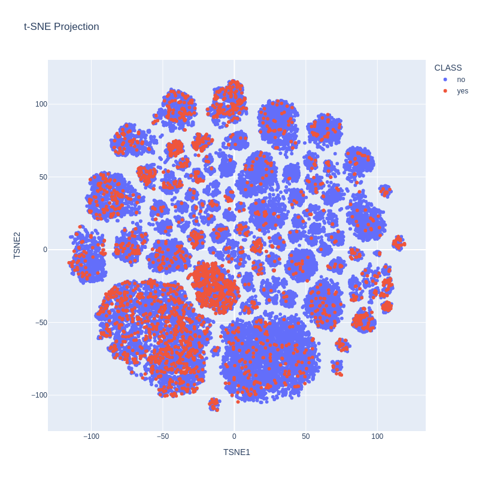
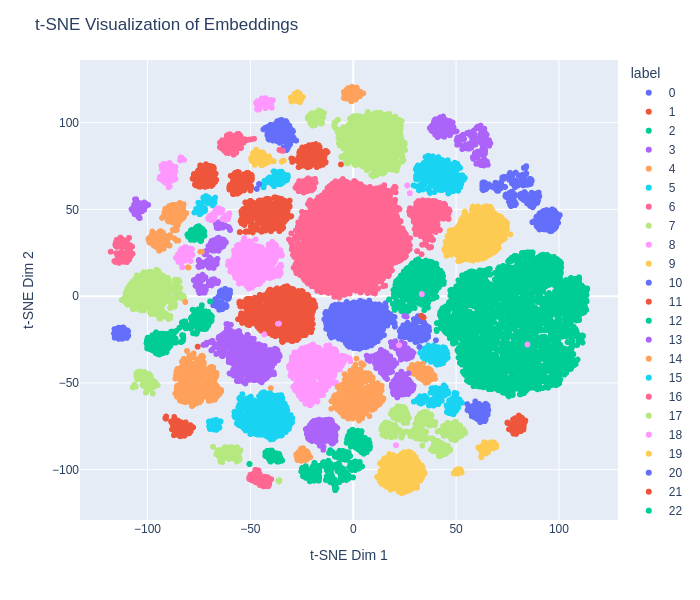
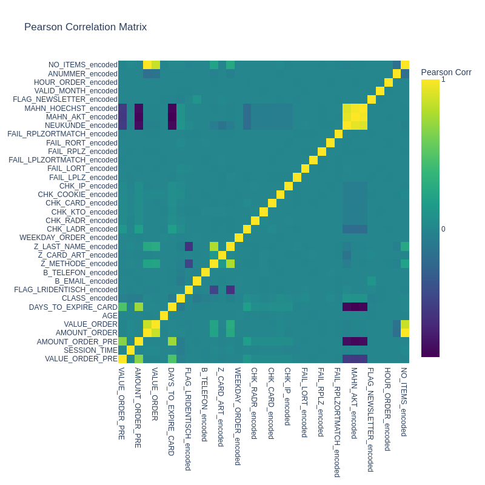
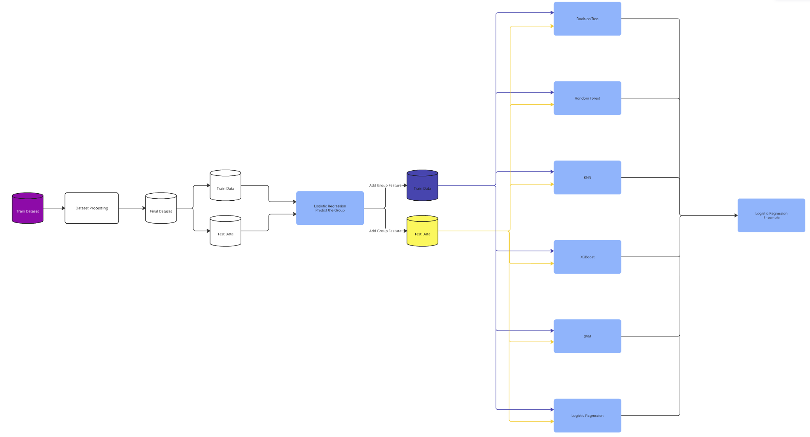

# Data Processing Report

## Overview

This report documents the data preprocessing steps taken to prepare the dataset for further analysis and modeling. It includes Exploratory Data Analysis (EDA), missing value treatment, outlier handling, feature engineering, and dimensionality reduction for clustering. The process aims to create an enriched and cleaned dataset suitable for training models and extracting insights.

---

1. [Data Loading and Initial Exploration](#data-loading-and-initial-exploration)
2. [Exploratory Data Analysis (EDA)](#exploratory-data-analysis)
3. [Missing Value Treatment](#missing-value-treatment)
4. [Outlier Detection and Handling](#outlier-detection-and-handling)
5. [Feature Engineering](#feature-engineering)
6. [Dimensionality Reduction and Clustering](#dimensionality-reduction-and-clustering)
7. [Correlation Analysis](#correlation-analysis)
8. [Model Evaluation and Results](#model-evaluation-and-results)
9. [Conclusion](#conclusion)
---

## 1. Data Loading and Initial Exploration

We started with loading the raw dataset, consisting of various numerical and categorical variables. Initial data exploration was conducted to understand the structure, distribution, and basic statistics of each feature.

---

## 2. Exploratory Data Analysis

EDA focused on identifying the distributions of numerical and categorical variables, as well as visualizing the balance in categorical columns. This step helps us understand the dataset's overall structure and informs subsequent steps for data cleaning and transformation.

---

## 3. Missing Value Treatment

Missing values were identified in both numerical and categorical columns. Different strategies were employed to handle these missing values, including Bayesian filling, KNN filling, and model-based imputation.

During the analysis, we found missing values only in categorical columns. After testing different imputation methods, including Bayesian filling and KNN, we determined that KNN performed better for filling in missing values in these categorical columns.

Write here the numbers .... 

---

## 4. Outlier Detection and Handling

Outliers were detected by analyzing the distributions of numerical columns. We tested different methods to handle these outliers, including capping values based on the 2nd and 3rd standard deviations. After evaluation, we found that using the 3rd standard deviation for capping provided the best results, effectively reducing the influence of extreme values without overly trimming the data.

---

## 5. Feature Engineering

New features were engineered to enhance model performance. Key new features include:
- **AGE**
- **EXPIRATION_MONTH**
- **HOUR_ORDER**
- **DAYS_TO_EXPIRE_CARD**

These features contribute to capturing more predictive signals in the dataset.

Additionally, we applied a transformation to **explode** the `ANUMMER` values. Initially, the dataset had multiple `ANUMMER` columns (`ANUMMER_01` to `ANUMMER_10`), each representing different items associated with an `ORDER_ID`. The purpose of this transformation was to capture the information of each item separately. Here’s what this process involved:

1. **Consolidating Columns**: Instead of having each `ANUMMER` in a separate column, we combined all these columns into a single column, where each row now contains an `ORDER_ID` and an associated `ANUMMER` value. This process, known as "melting," reshapes the data to a long format, making each `ANUMMER` value an independent entry.

2. **Simplifying Data Structure**: By reshaping the data this way, it becomes easier to analyze each `ANUMMER` item individually. Each row in the transformed dataset represents a unique combination of `ORDER_ID` and `ANUMMER`, allowing us to focus on the characteristics of each item separately.

3. **Removing Duplicates**: To avoid redundancy, we ensured each `ORDER_ID` and `ANUMMER` combination is unique. This step removes any duplicate items for each order, streamlining the data further.

4. **Reattaching Original Information**: We then merged this reshaped data back with the original dataset to retain other attributes related to each `ORDER_ID`, ensuring no important information was lost in the transformation.

5. **Cleaning Up**: Finally, we removed the original `ANUMMER_01` to `ANUMMER_10` columns from the dataset since they were now represented by the single consolidated `ANUMMER` column. This reduces the dataset's dimensionality and simplifies further analysis.

**Summary**: This transformation allowed us to "explode" the `ANUMMER` columns, capturing each item associated with an order as a separate entry. This restructuring enables more detailed analysis, as each item (`ANUMMER`) is now treated independently, providing a clearer view of individual items within each order.

---

## 6. Dimensionality Reduction and Clustering

To gain insights into the data's separability, t-SNE was applied for dimensionality reduction. The t-SNE projection revealed that the dataset has a complex structure, with significant overlap between classes. This visualization highlights that any model based purely on regression would struggle to create a clear hyperplane to separate the classes effectively. 

Due to the overlapping nature of the data points, it is apparent that simpler models like Logistic Regression, Single Nearest Neighbor, or SVM may not perform well. Instead, deep learning models, with their ability to capture non-linear relationships, would likely be required to achieve satisfactory performance on this dataset.

### t-SNE Visualization
The t-SNE projection shows the separability of different classes in a 2D space.

With t-SNE, we identified distinct clusters with varying densities of Class 0 (Low Risk) and Class 1 (High Risk). Analyzing the t-SNE projections, we observed that some clusters had a noticeably lower concentration of Class 0 cases, while others contained fewer Class 1 cases. This variance in class density within clusters reveals underlying structure in the data, suggesting that certain patterns and relationships between features are specific to each group.
So we decided to use the Cluster ID as part of the features, for this a logistic regression model was created to predict in which group the data could be.

---

## 7. Correlation Analysis

A Pearson Correlation Matrix was generated to identify potential multicollinearity among the features. Features with high correlations were candidates for removal or dimensionality reduction techniques.

---

## 8. Conclusion

The data preprocessing workflow described in this report led to a refined dataset with minimal missing values, reduced outliers, enriched features, and identified clusters. The final dataset is ready for model training and holds promise for accurate and insightful analysis.

---

## Model Evaluation and Results

The objective of the modeling process was to develop a classifier that could effectively distinguish between two classes: **Class 0 (Low Risk)** and **Class 1 (High Risk)**. The primary goal was to maximize the model's precision and recall, particularly focusing on Class 1 (High Risk), where minimizing false negatives (FN) is critical to avoid misclassifying high-risk cases as low risk.

The dataset was processed as outlined in the data processing flow, and various models were evaluated based on their ability to classify accurately across both classes. Below is a summary of the models and their respective performance metrics.

| Model                        | Accuracy | Precision | Recall | F1    |
|------------------------------|----------|-----------|--------|-------|
| Decision Tree                | 0.9789   | 0.8148    | 0.8273 | 0.8210 |
| Random Forest                | 0.9677   | 1.0000    | 0.4471 | 0.6179 |
| K-Nearest Neighbors (KNN)    | 0.9307   | 0.1366    | 0.0348 | 0.0555 |
| XGBoost                      | 0.9607   | 0.9644    | 0.3398 | 0.5026 |
| Support Vector Classifier    | 0.9361   | 0.2035    | 0.0320 | 0.0554 |
| Ensemble Model               | 0.9679   | 0.6812    | 0.8482 | 0.7556 |

### Decision Tree
The Decision Tree model performed well, achieving high accuracy. However, it had a lower recall for Class 1 compared to Class 0, indicating that it could potentially miss some high-risk cases, albeit at a manageable level.

### Random Forest
Random Forest achieved perfect precision for Class 1, but with a recall of only 0.4471. This indicates that while it rarely misclassifies low-risk cases as high risk, it struggles with capturing all high-risk cases, resulting in many false negatives. This limitation is critical since the goal is to minimize high-risk cases being misclassified as low risk.

### K-Nearest Neighbors (KNN)
KNN did not perform well in identifying high-risk cases (Class 1), with low precision, recall, and F1 scores for this class. The model's limited ability to differentiate between the classes suggests that KNN is not suitable for this problem.

### XGBoost
XGBoost showed high precision but relatively low recall for Class 1, similar to the Random Forest model. Although it performs well in correctly classifying low-risk cases, its recall for high-risk cases is limited, leading to a significant number of false negatives.

### Support Vector Classifier (SVM)
SVM's performance was inadequate for Class 1, as it had a very low recall and F1 score, indicating an inability to correctly classify high-risk cases. This suggests that SVM may not be suitable for the current dataset's distribution and structure.

### Ensemble Model (Logistic Regression Ensemble)
The ensemble model, which combined predictions from multiple models using logistic regression, achieved a balanced performance with high recall for Class 1. This model managed to strike a compromise between precision and recall, thus effectively reducing false negatives, which is crucial for identifying high-risk cases.

### Connection to Data Processing Findings

The results of the modeling phase align with insights from the data processing phase:
- **t-SNE Findings**: The t-SNE projection demonstrated significant overlap between classes, indicating that simpler, linear models would struggle to separate the classes effectively. This observation was validated in the performance of the simpler models (e.g., KNN and SVM), which exhibited poor recall for Class 1.
- **Handling Outliers**: Using the 3rd standard deviation for capping outliers in numerical features helped maintain data integrity without removing important high-risk cases, which contributed to the models' ability to detect Class 1 cases better.
- **Balancing Precision and Recall**: Given that misclassifying high-risk cases as low risk (false negatives) is more critical to avoid, the ensemble model’s high recall for Class 1 proves advantageous. This model can catch more high-risk cases, albeit at a slight compromise in precision, aligning with the need to prioritize recall for Class 1.

### Conclusion

The ensemble model proved to be the most effective approach for this problem, achieving a balanced precision-recall performance for Class 1. This model successfully reduces false negatives, thereby addressing the core objective of minimizing high-risk cases predicted as low risk. The findings from the data processing phase were integral in guiding model selection and tuning, and they underscore the importance of using advanced models to tackle complex data structures where simpler models fall short.

